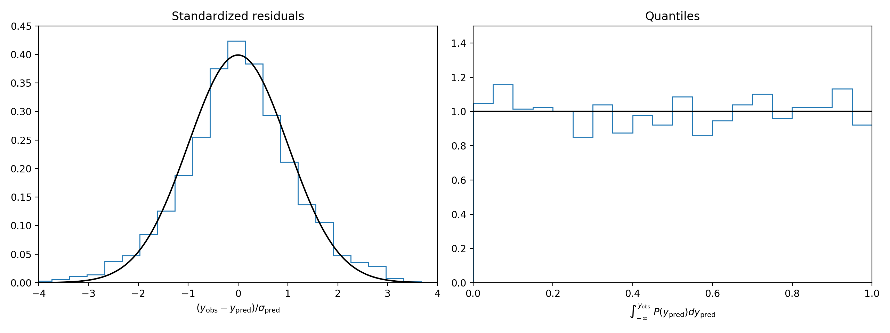

NFL Model
=========

*NFL ratings and predictions*

This package trains the [Elo regressor algorithm (elora)](https://github.com/morelandjs/elora) to predict NFL point spread and point total outcomes.

Installation
------------

```
git clone https://github.com/morelandjs/nflmodel.git && cd nflmodel
pip install .
```

Quick Start
-----------
First train the model on historical game data (this will take a minute or two)
```
> nflmodel calibrate --steps 100
```
Once trained, the model can generate point spread and point total predictions for arbitrary matchups in the future.
```
> nflmodel predict 2019-12-08 CLE BAL --spread -110 -115 -12 --total -110 -110 45

[INFO][nflmodel] 2019-12-08 CLE at BAL

               away   home
team            CLE    BAL
win prob        15%    85%
spread         13.8  -13.8
total          45.0   45.0
score            16     29
spread cover    45%    55%
spread return  -16%     4%

               over  under
total cover     50%    50%
total return    -5%    -5%

*actual return rate lower than predicted
```
as well as rank teams at a certain moment in time by their expected performance against a league average opponent
```
> nflmodel rank --datetime 2020-01-09

[INFO][nflmodel] Rankings as of 2020-01-09

       win prob        spread         total
rank
1     BAL  0.80  │  BAL  11.4  │   TB  49.7
2      KC  0.72  │   KC   8.1  │   KC  48.4
3      NO  0.68  │   NO   6.4  │   NO  48.3
4      NE  0.67  │   NE   5.8  │  MIA  47.2
5      SF  0.65  │   SF   5.4  │  NYG  46.6
6     MIN  0.64  │  MIN   5.0  │   LA  46.6
7     DAL  0.63  │  DAL   4.5  │   SF  46.5
8     TEN  0.62  │  TEN   4.2  │  CAR  46.5
9      GB  0.57  │   GB   2.4  │  ATL  46.5
10     LA  0.57  │   LA   2.4  │  BAL  45.6
11    SEA  0.54  │  SEA   1.4  │  SEA  45.5
12    PHI  0.53  │  PHI   1.1  │  ARI  45.1
13    BUF  0.53  │  BUF   1.1  │  DET  45.1
14    ATL  0.53  │  ATL   1.0  │  HOU  45.0
15    HOU  0.51  │  HOU   0.4  │  IND  45.0
16    CH  0.51  │  CHI   0.4  │  OAK  44.8
17     TB  0.51  │   TB   0.2  │   GB  44.7
18    LAC  0.50  │  LAC  -0.1  │  DAL  44.6
19    PIT  0.49  │  PIT  -0.3  │  CLE  44.6
20    IND  0.48  │  IND  -0.7  │  CIN  44.3
21    DEN  0.46  │  DEN  -1.2  │  PHI  44.1
22    CLE  0.41  │  CLE  -3.0  │  LAC  43.9
23    ARI  0.40  │  ARI  -3.5  │  WAS  43.6
24    NYJ  0.39  │  NYJ  -3.9  │  TEN  43.5
25    DET  0.39  │  DET  -3.9  │   NE  43.1
26    JAX  0.35  │  JAX  -5.2  │  MIN  43.1
27    NYG  0.35  │  NYG  -5.4  │  NYJ  42.8
28    OAK  0.33  │  OAK  -5.8  │  PIT  41.9
29    CIN  0.33  │  CIN  -6.1  │  JAX  41.8
30    CAR  0.31  │  CAR  -6.8  │  DEN  40.2
31    MIA  0.30  │  MIA  -7.3  │  BUF  39.8
32    WAS  0.28  │  WAS  -7.9  │  CHI  39.5

*expected performance against league average
opponent on a neutral field
```

Additionally, the package can back test and validate its own predictions. The command
```
> nflmodel validate
[INFO][validate] spread residual mean: 0.04
[INFO][validate] spread residual mean absolute error: 10.64
[INFO][validate] total residual mean: 0.04
[INFO][validate] total residual mean absolute error: 10.81
```
generates two figures, `validate_spread.pdf` and `validate_total.pdf`, that visualize
the distribution of prediction residuals and quantiles.

Quick inspection shows the model's point spread residuals are perfectly normal and its quantiles sample a uniform normal distribution as desired.


